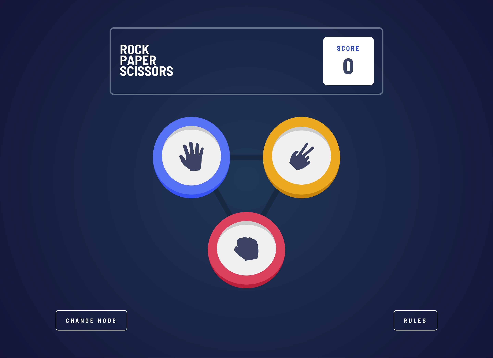
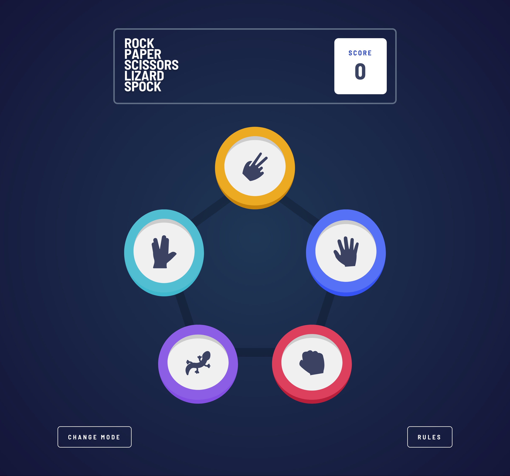

# Frontend Mentor - Rock, Paper, Scissors solution

This is a solution to the [Rock, Paper, Scissors challenge on Frontend Mentor](https://www.frontendmentor.io/challenges/rock-paper-scissors-game-pTgwgvgH).

## Table of contents

- [Overview](#overview)
  - [The challenge](#the-challenge)
  - [Screenshots](#screenshots)
  - [Links](#links)
  - [Built with](#built-with)

## Overview

### The challenge

Users should be able to:

- View the optimal layout for the game depending on their device's screen size
- Play Rock, Paper, Scissors against the computer
- Play Rock, Paper, Scissors, Lizard, Spock against the computer

### Screenshots

### Links

- Live Site URL: [https://vasubeachoo.github.io/rock-paper-scissors/](https://vasubeachoo.github.io/rock-paper-scissors/)

### Built with

- React
- Redux
- styled-components
- Flexbox
- CSS Grid
